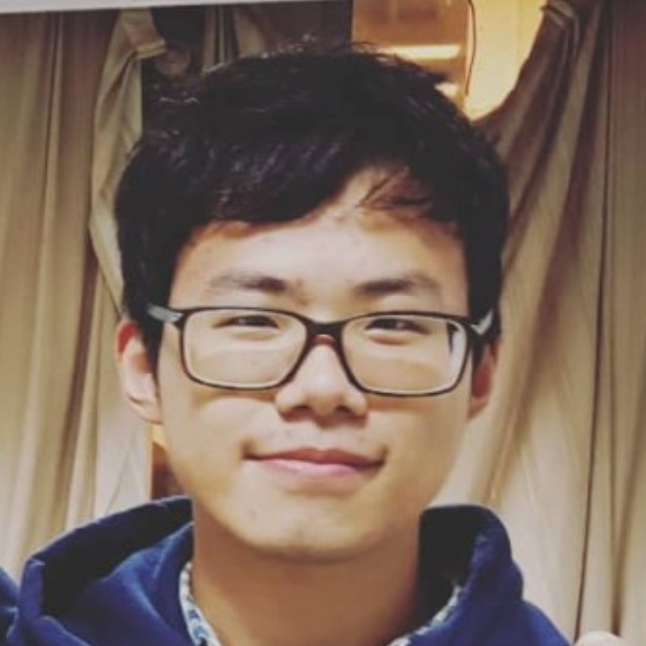

# About Me

Hello! I’m **Xinyi Ni(倪心逸)**.  
I am a Ph.D. candidate in Computer Science at [Brandeis University](https://www.brandeis.edu/), advised by [Prof. Pengyu Hong](https://www.cs.brandeis.edu/~hong/). My research focuses on **Large Language Model (LLM) agents** and **automatic tool generation** from unstructured REST API documentation. I am particularly interested in making AI agents more capable, reliable, and universally applicable across domains.  

I earned my B.A. in Financial Mathematics from Soochow University, where I built a strong analytical and quantitative foundation. During that time, I studied as a visiting student at **UC Berkeley**, taking courses in data structures, algorithms, and machine learning, which sparked my passion for artificial intelligence and intelligent systems.  

I am always open to research collaborations and job opportunities. Feel free to reach out with email!

---

## Research Interests

- Large Language Model Agents
- Automatic Tool Generation from REST APIs
- Agent Planning and Reasoning
- Knowledge Extraction from Unstructured Data
- API-based Web Agents and Evaluation
- AI for Scientific Research

---

<!-- ## News and Updates

- **May 2025**：Delighted to be selected as a winner of the 2025 Cambridge-CSC Scholarship!
- **June 2024**：Very excited to be selected as [KDD UC Scholar](https://kdd2024.kdd.org/undergraduate-consortium/). See you in Spain!
- **April 2024：**Our work *BLEGuard* has been accepted to [MobiSys 2024](https://www.sigmobile.org/mobisys/2024/) as a poster paper. See you in Japan!
- **March 2024：**Happy to receive a MPhil offer from Department of Engineering at Cambridge!
- **Dec 2023：**Very excited to be selected as [AAAI UC Scholar](https://aaai.org/aaai-conference/undergraduate-consortium-program/). See you in Canada!

 

<blockquote class="twitter-tweet">
Thrilled to be an AAAI-UC Scholar at <a href="https://twitter.com/hashtag/AAAI24?src=hash&amp;ref_src=twsrc%5Etfw">#AAAI24</a>, thanks to <a href="https://twitter.com/hashtag/AAAI?src=hash&amp;ref_src=twsrc%5Etfw">#AAAI</a> &amp; <a href="https://twitter.com/hashtag/GoogleExploreCSR?src=hash&amp;ref_src=twsrc%5Etfw">#GoogleExploreCSR</a> for the sponsorship. Grateful for the knowledge gained and new friendships formed.  Wonderful trip in Vancouver. Looking forward to staying connected with all.<a href="https://twitter.com/hashtag/AAAI24?src=hash&amp;ref_src=twsrc%5Etfw">#AAAI24</a> <a href="https://twitter.com/hashtag/Vancouver?src=hash&amp;ref_src=twsrc%5Etfw">#Vancouver</a> <a href="https://twitter.com/hashtag/GoogleExploreCSR?src=hash&amp;ref_src=twsrc%5Etfw">#GoogleExploreCSR</a> <a href="https://t.co/wUQUp8XlSM">pic.twitter.com/wUQUp8XlSM</a>
&mdash; Hanlin CAI (seeking a PhD position 2025) (@lancecai2002) <a href="https://twitter.com/lancecai2002/status/1762210025173344260?ref_src=twsrc%5Etfw">February 26, 2024</a></blockquote> 
 -->
